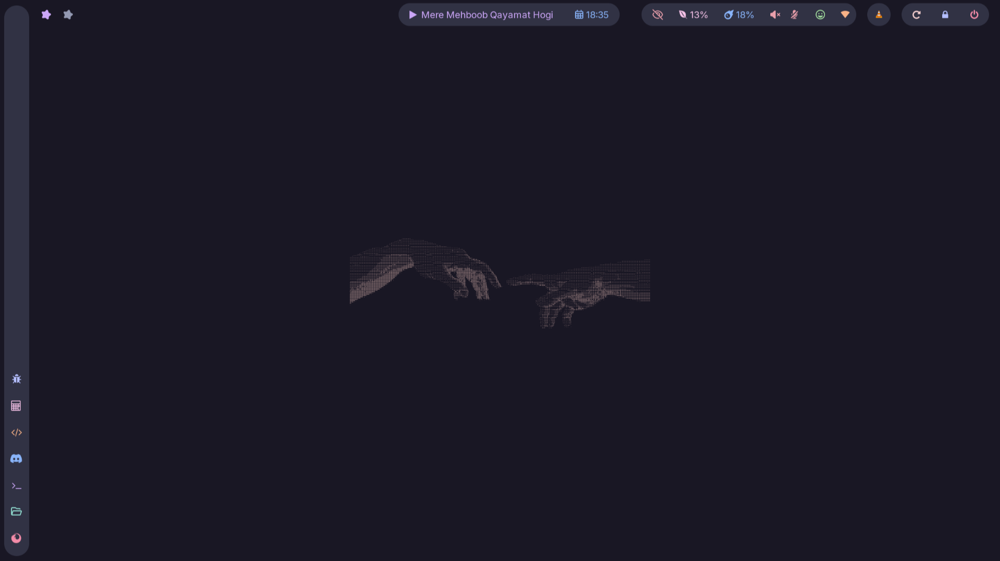
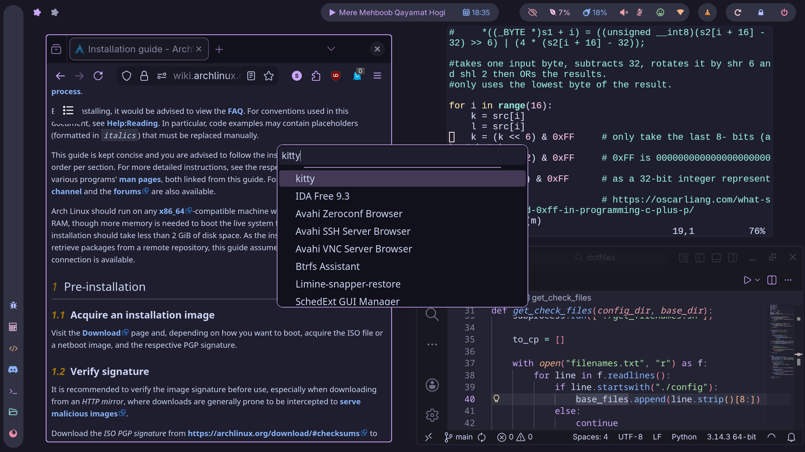

  <a href="#showcase">Showcase</a> •
  <a href="#setup">Setup</a>

 

# Showcase

# Setup

| Component Type | Setup |
|----------------|-------|
| Window Manager | [Hyprland](https://hypr.land/) |
| Sidebar        | [eww](https://elkowar.github.io/eww/)   |
| Status Bar     | [Waybar](https://github.com/Alexays/Waybar)|
| Theme          | [Catppuccin Mocha Mauve](https://catppuccin.com/palette/) |
| Wallpaper      | [ASCII Art by Wallhaven](https://wallhaven.cc/w/p9q6ym) |
